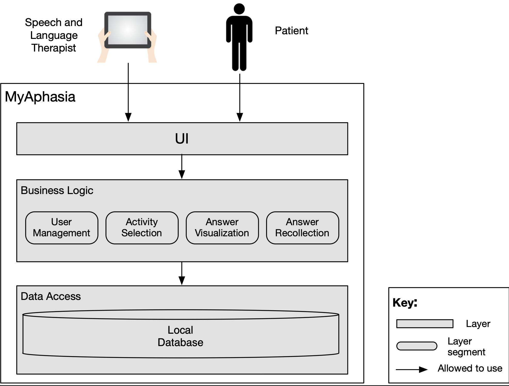

# AfasiaApp

A comprehensive Flutter application designed for speech therapy and aphasia treatment on tablet devices.

## 📋 Table of Contents
- [Description](#-description)
- [Features](#-features)
- [Prerequisites](#-prerequisites)
- [Installation](#-installation)
- [Usage](#-usage)
- [Project Structure & Software Architecture](#-project-structure--software-architecture)
  - [Repository Structure](#repository-structure)
  - [High-Level Architecture](#high-level-architecture)
  - [Therapy Module Implementation](#therapy-module-implementation)
  - [Data Flow & Communication](#data-flow--communication)
- [Development Rules and Practices](#-development-rules-and-practices)
  - [Architectural Patterns](#architectural-patterns)
  - [Development Practices](#development-practices)
  - [Development Rules](#development-rules)
- [Technologies](#-technologies)
- [Contributing](#-contributing)
- [License](#-license)
- [Support](#-support)

## 📖 Description

AfasiaApp is a specialized mobile application developed for tablets, designed to assist in speech therapy and aphasia treatment. This project was created as part of a Civil Computer Engineering degree program and focuses on providing interactive activities to help patients with language disorders improve their communication skills.

The application includes various therapeutic activities such as:
- **Reading Comprehension**: Interactive exercises to improve reading skills
- **Object Nomination**: Activities to help patients identify and name objects
- **Action Nomination**: Exercises focused on recognizing and naming actions
- **Audio Recording**: Capability to record and playback speech for therapy sessions
- **Progress Tracking**: Monitor patient progress through different activities

## ✨ Features

- 🎯 **Targeted Therapy Activities**: Specialized exercises for different aspects of language recovery
- 🎵 **Audio Integration**: Record, playback, and manage audio files for speech therapy
- 📱 **Tablet-Optimized UI**: Designed specifically for tablet devices with intuitive touch interfaces
- 📊 **Progress Tracking**: Monitor and save patient progress
- 🎨 **Interactive Elements**: Engaging visual components including color pickers and sliders
- 📷 **Image Handling**: Support for image selection and manipulation
- 💾 **Local Storage**: SQLite database for offline data management

## 🔧 Prerequisites

Before you begin, ensure you have the following installed:

### Using FVM (Flutter Version Management) - Recommended

1. **Install FVM** (if not already installed):
   ```bash
   # Using pub
   dart pub global activate fvm
   
   # Or using Homebrew (macOS)
   brew tap leoafarias/fvm
   brew install fvm
   ```

2. **Install the required Flutter version**:
   ```bash
   fvm install 2.8.1
   fvm use 2.8.1
   ```

### Alternative: Direct Flutter Installation

- [Flutter SDK 2.8.1](https://flutter.dev/docs/get-started/install)
- [Dart SDK 2.15.1](https://dart.dev/get-dart)
- Android Studio or VS Code with Flutter extensions
- Android SDK (for Android development)
- Xcode (for iOS development, macOS only)

### Device Requirements

- Android device/emulator (API level 16+)
- iOS device/simulator (iOS 9.0+)
- **Recommended**: Tablet device for optimal user experience

## 🚀 Installation

### Step 1: Clone the Repository
```bash
git clone https://github.com/asanchezRay/afasiaApp.git
cd afasiaApp
```

### Step 2: Set Up Flutter Version (Using FVM)
```bash
# If using FVM
fvm use 2.8.1

# Verify the Flutter version
fvm flutter --version
```

### Step 3: Install Dependencies
```bash
# Using FVM
fvm flutter pub get

# Or without FVM
flutter pub get
```

### Step 4: Verify Device Connection
```bash
# Using FVM
fvm flutter devices

# Or without FVM
flutter devices
```

### Step 5: Run the Application
```bash
# For development/debugging (using FVM)
fvm flutter run

# Or without FVM
flutter run

# For release build
fvm flutter build apk --release
```

## 📱 Usage

### Running in Development Mode
```bash
# Start the app in debug mode
fvm flutter run

# Run with specific device
fvm flutter run -d <device-id>

# Run in release mode
fvm flutter run --release
```

### Building for Production
```bash
# Build APK for Android
fvm flutter build apk --release

# Build App Bundle for Google Play Store
fvm flutter build appbundle --release

# Build for iOS (macOS only)
fvm flutter build ios --release
```

## 📁 Project Structure & Software Architecture

Internally, AfasiaApp implements an architecture of three layers, specifically designed for speech therapy applications, focusing on modularity, modifiability, and clinical effectiveness. The architecture provides a clear separation of concerns between presentation (user interface), business logic, and data persistence (data access) layers.

### Repository Structure

The repository structure directly reflects the application's architecture:

```
afasiaApp/
├── android/                 # Android-specific files
├── assets/                  # Application assets
│   ├── audio/              # Audio files for therapy
│   ├── icons/              # App icons
│   └── images/             # Images used in activities
├── ios/                    # iOS-specific files
├── lib/                    # Main application code
│   ├── Screens/            # UI screens and pages
│   │   ├── Activities/     # Therapy activity screens
│   │   │   ├── Comprension/  # Comprehension exercises
│   │   │   ├── Escritura/    # Writing exercises
│   │   │   ├── Lectura/      # Reading activities
│   │   │   └── ReconocimientoAuditivo/ # Auditory recognition
│   │   ├── AddPatient/       # Patient management
│   │   ├── AssignTest/       # Test assignment
│   │   ├── Login/            # Authentication
│   │   ├── Profile/          # User profiles
│   │   ├── Revisar/          # Results review
│   │   └── Welcome/          # Welcome and onboarding
│   ├── components/         # User Interface Layer: Reusable components
│   ├── database/          # Data Access Layer
│   │   ├── models/        # Data models
│   │   └── database.dart  # SQLite implementation
│   ├── constants.dart     # Business Logic Layer: Global app constants
│   └── main.dart          # Application entry point
├── pubspec.yaml           # Dependencies and project configuration
└── README.md             # This file
```

Note the correspondence between repository structure and our architecture:

- **User Interface Layer**: `lib/Screens/` and `lib/components/`
- **Business Logic Layer**: `lib/Screens/Activities/{activity_type}/{activity}/controllers`
- **Data Access Layer**: `lib/database/`

### High-Level Architecture

The application architecture follows our architecture approach:

1. **User Interface Layer**
   - Composed of UI Components and Screens
   - Implements the Flutter Widget Tree pattern for UI rendering
   - Handles user input and visual feedback
   - Organized by therapy activity types (Reading, Writing, Comprehension, etc.)

2. **Business Logic Layer**
   - Implements clinical therapy workflows
   - Contains controllers for different activity types
   - Manages user session state and application flow
   - Coordinates between UI and data access layers

3. **Data Access Layer**
   - Repository pattern implementation (`database.dart`)
   - Entity models for domain objects (`models/` directory)
   - Handles local persistence through SQLite
   - Manages data transformations between domain and persistence formats


*Our architecture diagram implemented in AfasiaApp*

### Therapy Module Implementation

The therapy modules (Reading, Writing, Auditory Recognition) are implemented following our architecture:

1. **User Interface Components**:
   - Screens that present therapy exercises to patients
   - UI elements that capture patient responses and interactions
   - Visual and audio feedback components

2. **Business Logic**:
   - Therapy-specific business rules
   - Patient progress tracking logic
   - Scoring and evaluation algorithms

3. **Data Models and Storage**:
   - Structured data representations for therapy activities
   - Data persistence for patient responses
   - Progress tracking and reporting data structures

### Data Flow & Communication

The application implements a systematic data flow pattern:

1. User interactions are captured by the UI components
2. Events are passed to the appropriate controllers
3. Controllers process the events according to therapy rules
4. Data access layer persists results in the local SQLite database
5. UI is updated to reflect the new state

All communication between layers follows a strict dependency rule: higher layers may reference lower layers, but lower layers must not have direct dependencies on higher layers, ensuring a clean separation of concerns and improved maintainability.

## 📐 Design Patterns

AfasiaApp follows specific development rules and best practices to ensure code quality, maintainability, and scalability:

### Architectural Patterns

1. **Repository Pattern**: 
   - Implemented in the `AfasiaDatabase` class that centralizes all data access operations
   - Provides an abstraction over SQLite database operations
   - Facilitates separation between business logic and data access

2. **Singleton Pattern**:
   - Applied in the database implementation to ensure a single instance
   - Database connections are managed through a single access point
   - Prevents multiple database connections and ensures data consistency

3. **Factory Method Pattern**:
   - Used in question controllers to create different types of questions
   - The `_setQuestion()` method in controllers acts as a factory that produces questions based on difficulty level
   - Encapsulates the creation logic and provides a consistent interface

4. **Bridge Pattern**:
   - `RoundedInputField`, `RoundedDatepicker` and other components bridge the gap between raw Flutter widgets and application-specific styling

5. **Wrapper Pattern**:
   - Implemented in UI components like `TextFieldContainer` that wraps and adapts native widgets
   - The Flutter Phoenix wrapper in `main.dart` provides application restart functionality
   - Audio playback functionality is wrapped with `AssetsAudioPlayer` for simplified usage

### Development Practices

1. **Reusable UI Components**:
   - Implementation of custom reusable widgets in the `components/` folder
   - Examples: `rounded_button.dart`, `rounded_input_field.dart`, `gender_selector.dart`
   - Promotes UI consistency and reduces code duplication

2. **Service Organization**:
   - Use of external dependencies through Flutter's package system
   - Centralized service initialization in `main.dart`

### Development Rules

1. **Separation of Concerns**:
   - Each class and file has a single, well-defined responsibility
   - Directory structure reflects the different system responsibilities

2. **Object-Oriented Programming**:
   - Use of classes to model domain entities (patients, activities, etc.)
   - Encapsulation of data and behavior in specific models
   - Inheritance and polymorphism for different types of therapeutic activities

3. **State Management**:
   - Application state managed at the widget level when local
   - Critical state persistence through SQLite database

4. **Naming Conventions**:
   - Class names in PascalCase (e.g., `Paciente`, `Fonoaudiologo`)
   - Method and variable names in camelCase (e.g., `insertPaciente`, `getAllActividades`)
   - File names in snake_case (e.g., `rounded_button.dart`)

## 🛠 Technologies

### Core Framework

- **Flutter**: 2.8.1 - UI framework for cross-platform development
- **Dart**: 2.15.1 - Programming language

### Key Dependencies

- **sqflite**: ^1.3.0 - SQLite database for local storage
- **flutter_sound**: ^2.0.3 - Audio recording and playback
- **image_picker**: ^0.8.0+4 - Image selection functionality
- **http**: ^0.13.1 - Network requests
- **get**: ^3.24.0 - State management and navigation
- **flutter_localizations** - Internationalization support

### UI Components

- **syncfusion_flutter_sliders**: ^18.4.35-beta - Interactive sliders
- **flutter_colorpicker**: ^0.3.5 - Color selection tools
- **flutter_spinkit**: ^4.1.2 - Loading animations
- **badges**: ^1.1.6 - UI badges and indicators

### Utilities

- **permission_handler**: ^5.0.1+1 - Device permissions management
- **path_provider**: ^2.0.2 - File system access
- **screenshot**: ^0.3.0 - Screen capture functionality
- **flutter_phoenix**: ^1.0.0 - App restart capability

## 🤝 Contributing

We welcome contributions to improve AfasiaApp! Please follow these steps:

1. Fork the repository
2. Create a feature branch (`git checkout -b feature/AmazingFeature`)
3. Commit your changes (`git commit -m 'Add some AmazingFeature'`)
4. Push to the branch (`git push origin feature/AmazingFeature`)
5. Open a Pull Request

### Development Guidelines

- Follow Flutter/Dart coding conventions
- Add comments for complex logic
- Test your changes on both Android and iOS
- Update documentation as needed

## 📄 License

This project is licensed under the MIT License - see the [LICENSE](LICENSE) file for details.

## 📞 Support

If you encounter any issues or have questions:

1. Check the [Issues](https://github.com/asanchezRay/afasiaApp/issues) page
2. Create a new issue with detailed information
3. Contact the development team
